# Dual channel modem Xingkai Tech XK-F358

Overview of a Chinese modem from a downed UAV.

## Structure

Photo of the modem overview:

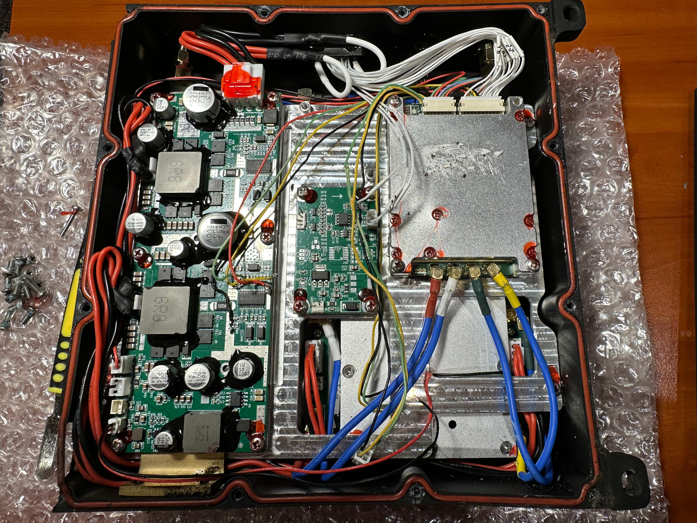

Power amplifier and LNA:

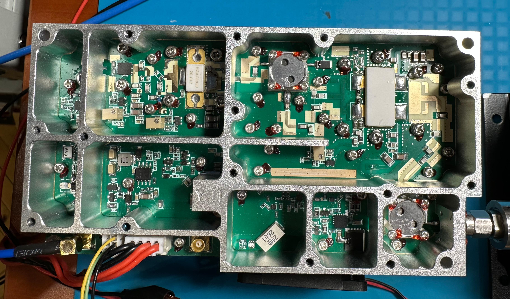

Overall structure of the device:

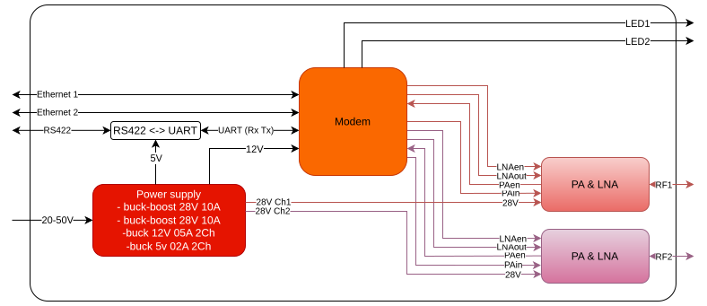

In general, the device consists of a power supply unit, a modem, a power amplifier, and an LNA. 

 Structure of the modem:

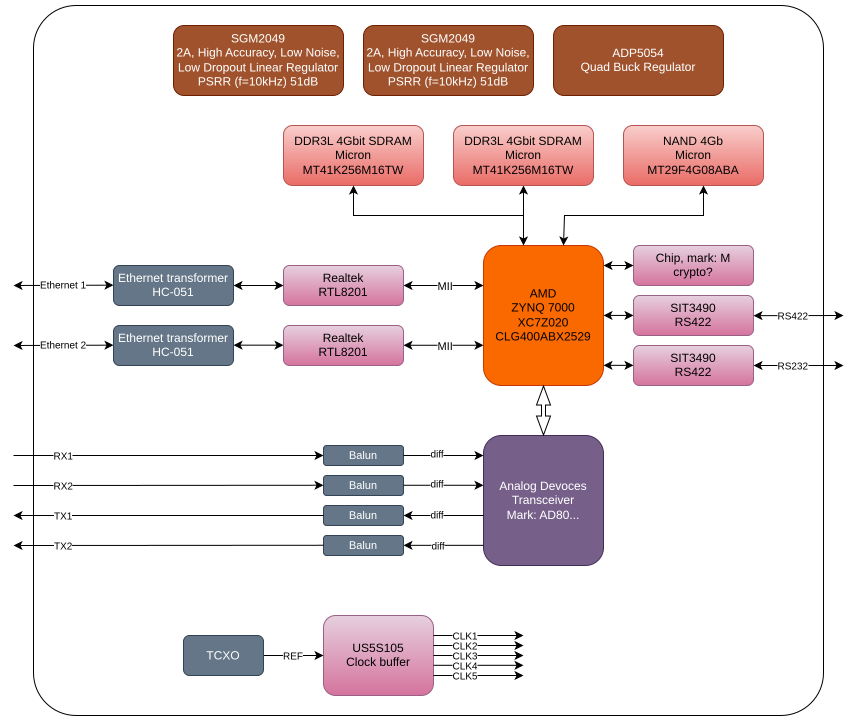

## PA and LNA measurements

### Test stand

All software is written in Python. The libraries for the measurement instruments are developed using the [PyMeasure](https://github.com/pymeasure/pymeasure) framework.
A Sorensen XHR 40-25 is used as the main power supply. A [PS3604L](https://github.com/d-el/PS3604L) is used as the power supply for controlling the PAen signal.

To measure the spectral density, a signal analyzer with a built-in signal generator is used. The trace mode is set to Max Hold.

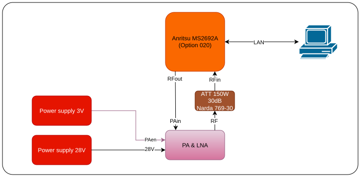

The following test setup is used to measure the dependence of output power on input power, as well as the dependence of output power on frequency at constant input power.

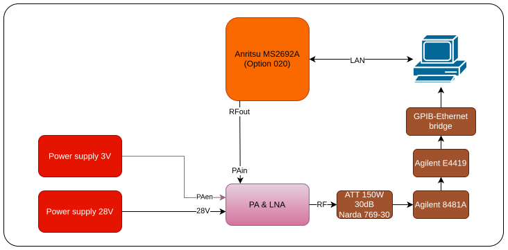

Stand photo:

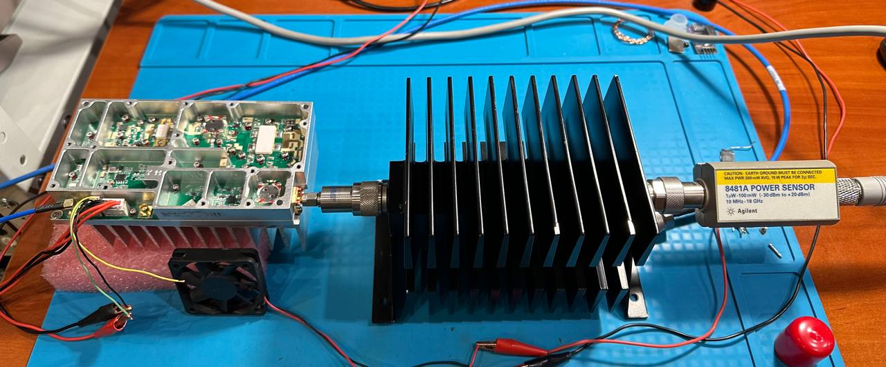

### Measurements results

Pout vs Pin, F=3.3GHz:

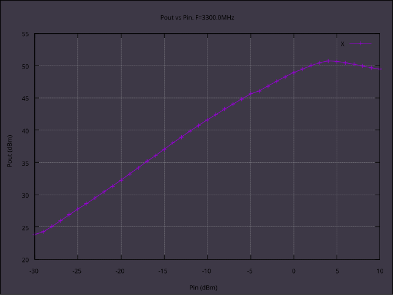

Pout vs frequency, Pin=4dBm:

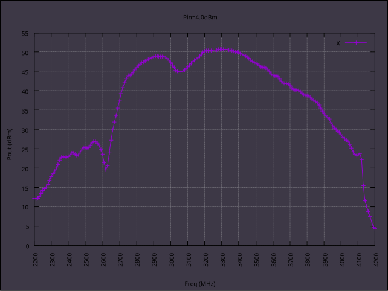

Pin=4dBm, trace mode Max Hold, Fmin 2.2GHz, Fmax 8.4GHz:

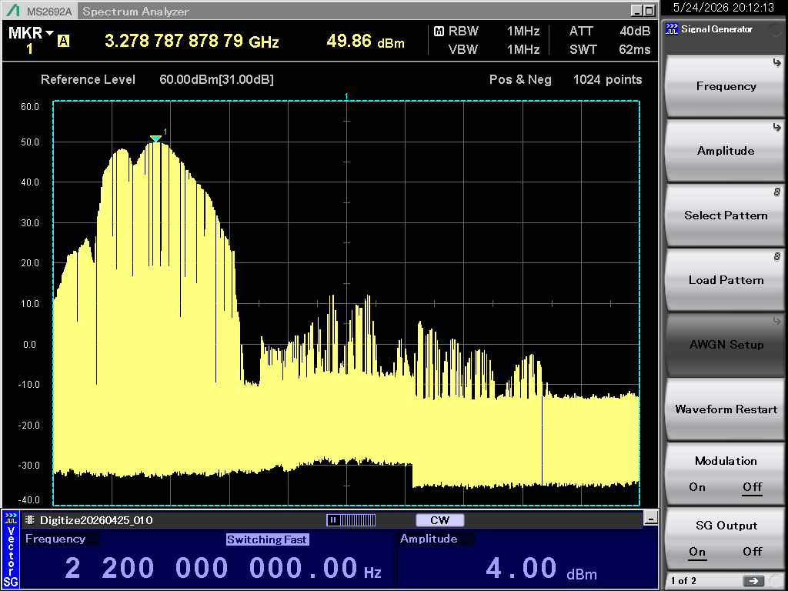

As can be seen from the graphs, within the 3.2–3.4GHz frequency band, the output power exceeds 50dBm.
The P1dB compression point is 51dBm. At the same time, the power consumption is 28V at 11.2A.
The no-input current is 0.9 A.

## Power supply

The main power supply is built using a buck-boost topology based on the LM5176. Each switch consists of two parallel Q38N10N4 MOSFETs.
The power supply can deliver up to 11.5A without output voltage drop (Input voltage is 20V, taking into account the voltage drop across the wires). When the load current exceeds 11.5A, the voltage begins to drop.

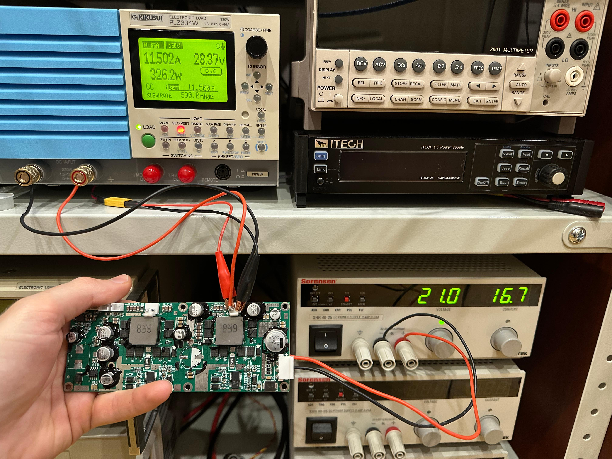